# Pipelined Posit Multiplier — FPGA Implementation

> A 32-bit Pipelined Posit Multiplier implemented in Verilog on FPGA, with full performance comparison against IEEE 754 floating-point multiplication.
> **Group 23** | Akshat Mittal (IMT2023606) · Nachiappan (IMT2023605)

---

## 📌 Project Overview

The **Posit number system** is an emerging alternative to IEEE 754 floating-point arithmetic. Introduced to provide higher accuracy and a larger dynamic range for the same number of bits, Posit uses a **dynamic bit allocation strategy** — unlike IEEE 754's fixed-width exponent and mantissa fields.

This project implements a **pipelined 32-bit Posit Multiplier** in Verilog, synthesized and implemented on FPGA using Xilinx Vivado, with detailed performance benchmarking against IEEE 754.

Key advantages of Posit over IEEE 754:
- Allocates **more bits to the fraction** (precision) when numbers are close to 1
- Allocates **more bits to the exponent** (range) when numbers are extremely large or small
- **No rounding errors at zero or infinity** — special values handled gracefully

---

## 📐 Posit Number Format

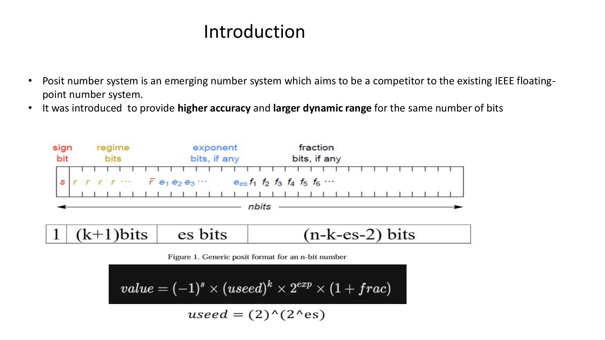

The value represented by a Posit number is:

**value = (−1)^s × (useed)^k × 2^exp × (1 + frac)**

where `useed = 2^(2^es)`

---

## ⚙️ Methodology — 3-Stage Pipeline


### Stage 1: Decode (Extraction)
- Extract regime bits using a **Leading Zero/One Detector (LZOD)** to determine run-length *k*
- Separate sign bit, exponent *e*, and fraction *f* from the 32-bit Posit format

### Stage 2: Execute (Core Computation)
- Calculate output sign using XOR
- Compute total scale factor using adder logic
- Perform mantissa multiplication **(1.f_A) × (1.f_B)** using **FPGA DSP48 slices** with pipelining

### Stage 3: Encode (Packing)
- Normalize the product by shifting fraction if result ≥ 2.0
- Apply rounding
- Re-pack sign, regime, exponent, and fraction into the final 32-bit Posit output

---

## 🏗️ Architecture

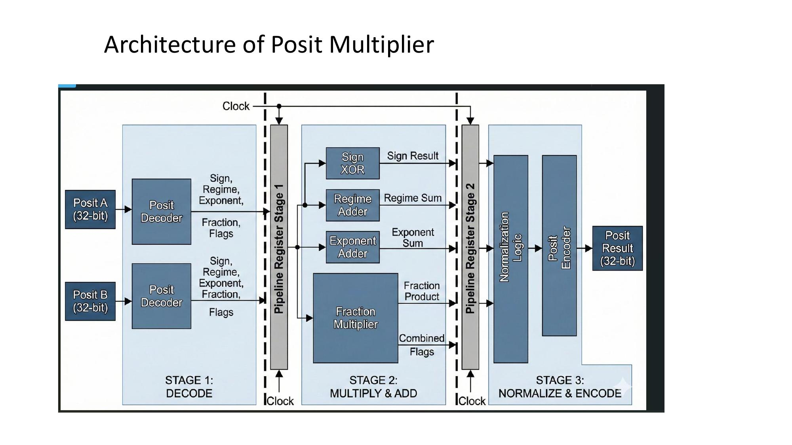

The 3-stage pipelined architecture separates **Decode → Multiply & Add → Normalize & Encode**, with pipeline registers between each stage for maximum throughput.

---

## 📊 Results

### Timing Summary

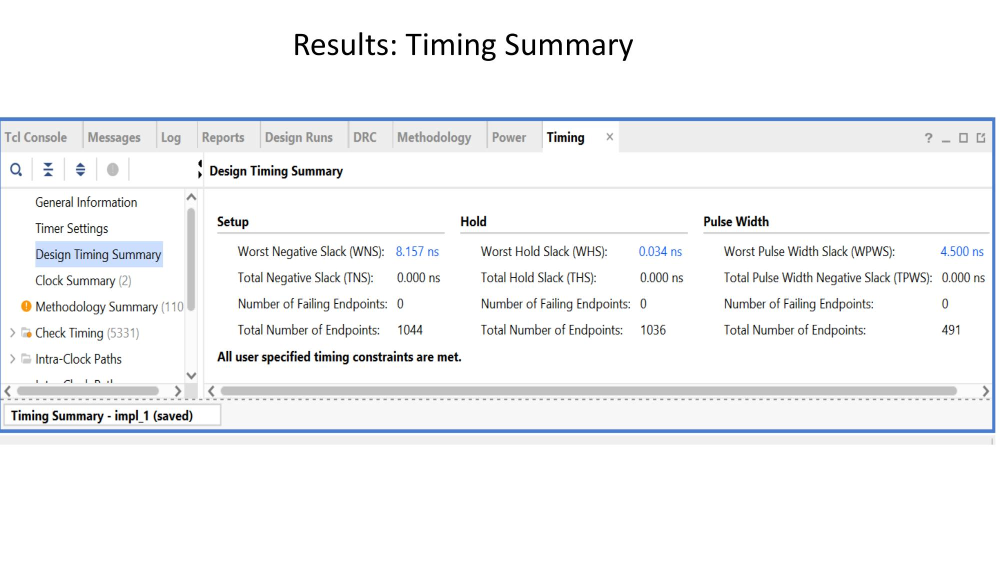

| Metric | Value |
|---|---|
| Worst Negative Slack (WNS) | 8.157 ns |
| Total Negative Slack (TNS) | 0.000 ns |
| Number of Failing Endpoints | 0 |
| Total Endpoints | 1044 |
| Status | ✅ All timing constraints met |

### Maximum Frequency

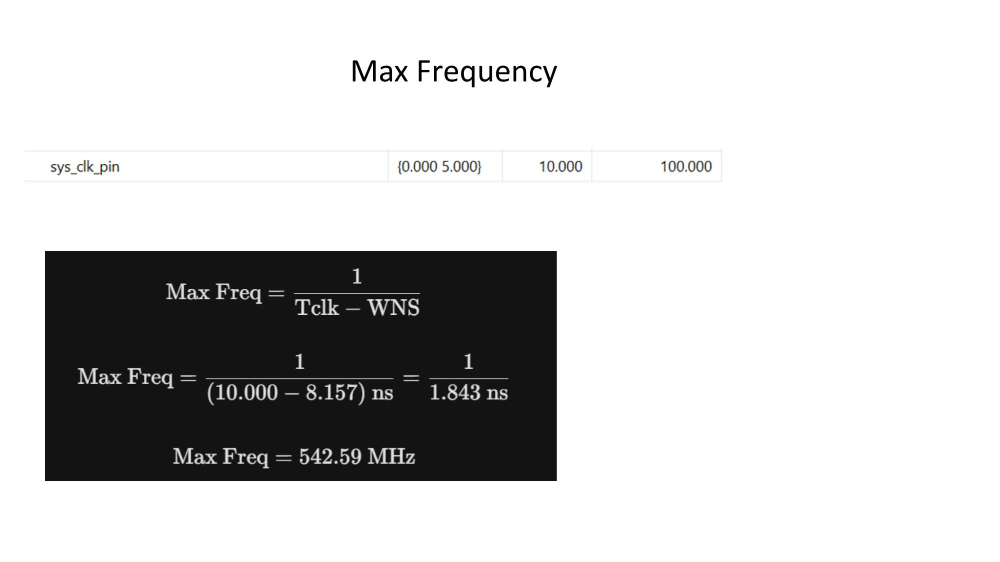

```
Max Freq = 1 / (Tclk − WNS)
         = 1 / (10.000 − 8.157) ns
         = 1 / 1.843 ns
         = 542.59 MHz
```

### Power Summary

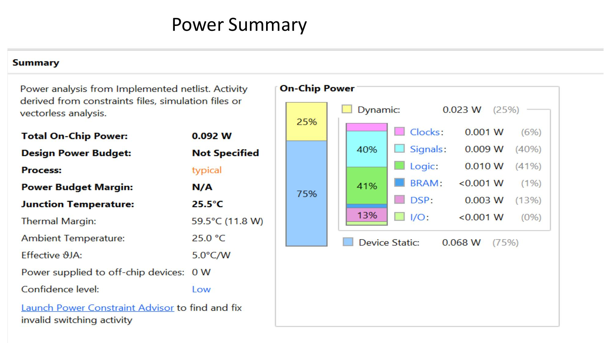

| Metric | Value |
|---|---|
| Total On-Chip Power | 0.092 W |
| Dynamic Power | 0.023 W (25%) |
| Device Static | 0.068 W (75%) |
| Junction Temperature | 25.5°C |
| Process | Typical |

### Resource Utilisation

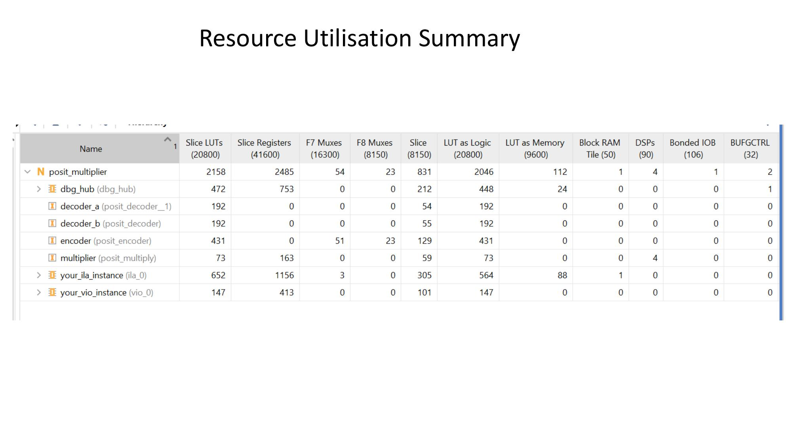

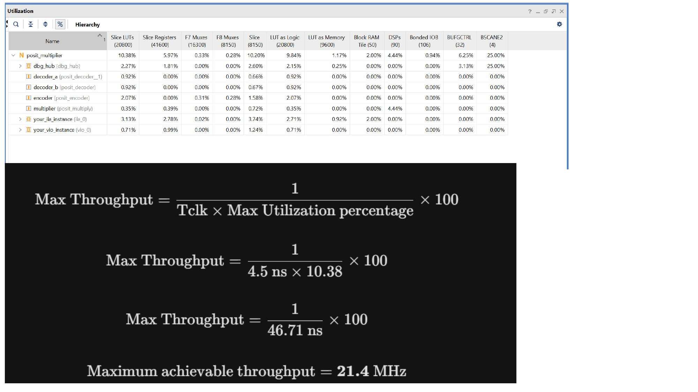

| Resource | Used | Available | Utilization % |
|---|---|---|---|
| Slice LUTs | 2158 | 20800 | 10.38% |
| Slice Registers | 2485 | 41600 | 5.97% |
| DSPs | 4 | 90 | 4.44% |
| Block RAM | 1 | 50 | 2.00% |
| Bonded IOB | 1 | 106 | 0.94% |

**Max Throughput = 1 / (Tclk × Max Utilization%) × 100 = 21.4 MHz**

---

## 🔌 Schematic

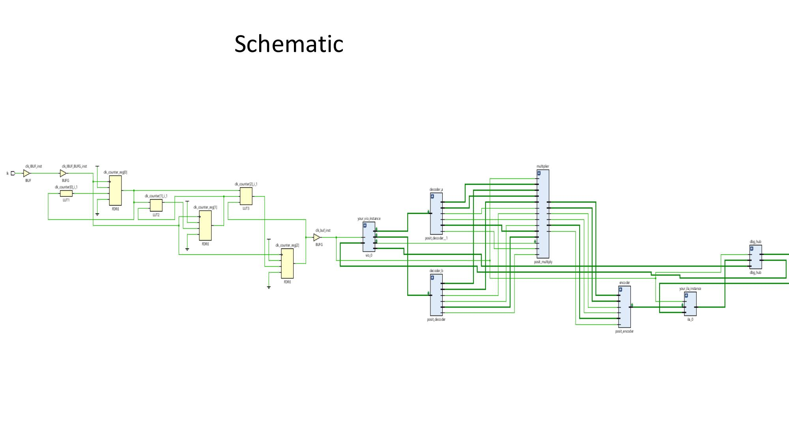

---

## 🔴 Critical Path

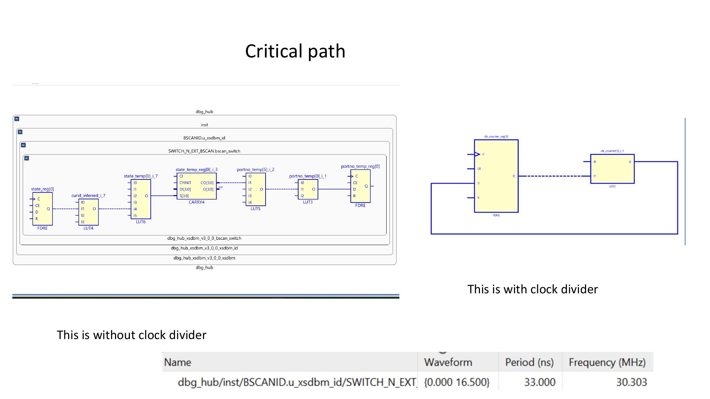

Two critical path analyses were conducted — **with and without clock divider**.

| Configuration | Period (ns) | Frequency (MHz) |
|---|---|---|
| Without clock divider | 33.000 | 30.303 |

---

## 🗺️ Implemented Layout Diagram

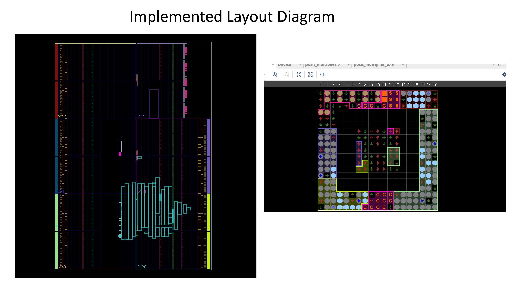

---

## 🧪 Simulation Results

### Behavioral Simulation (Vivado)

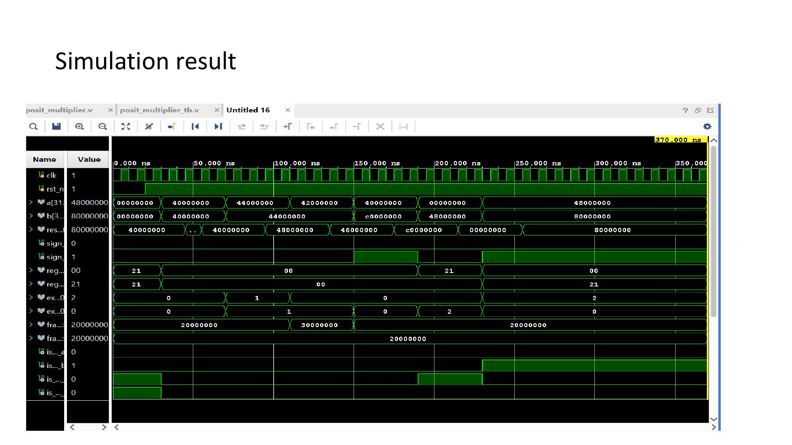

### Bitstream ILA (On-chip Hardware Verification)

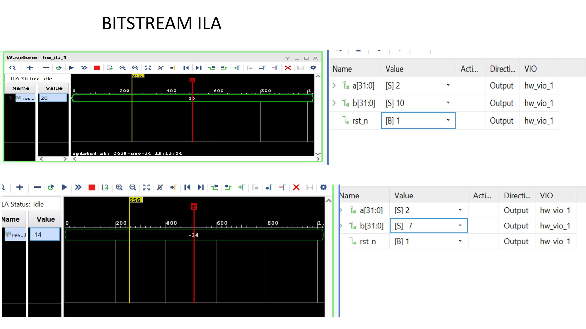

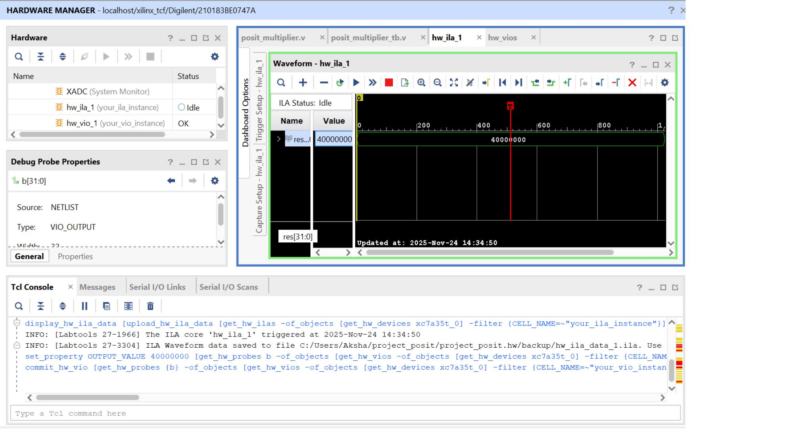

### Python Verification

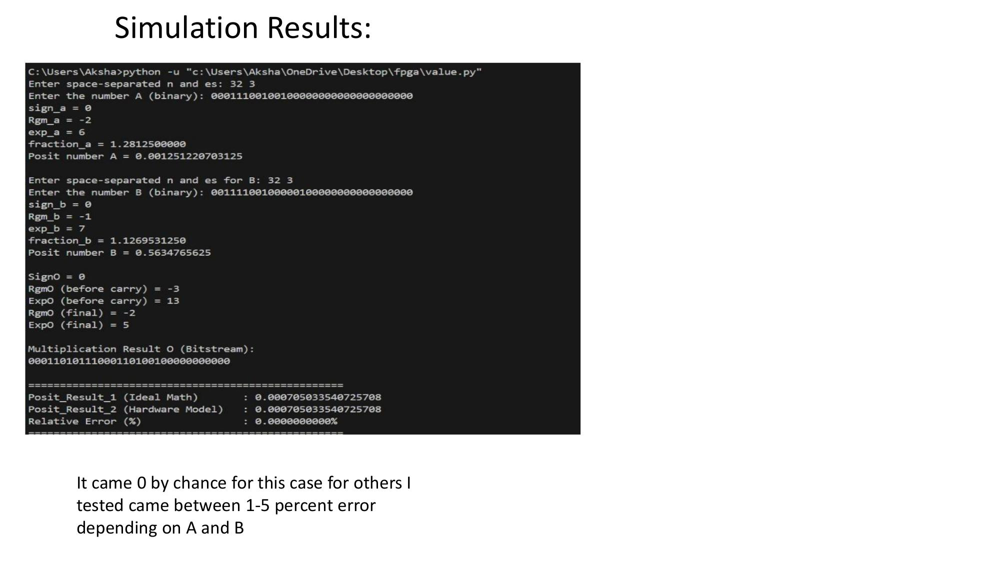

Relative error ranged from **0% to ~1–5%** depending on operand values, consistent with expected Posit approximation behavior.

---

## ⚖️ Comparison: Posit vs IEEE 754

### IEEE 754 Format

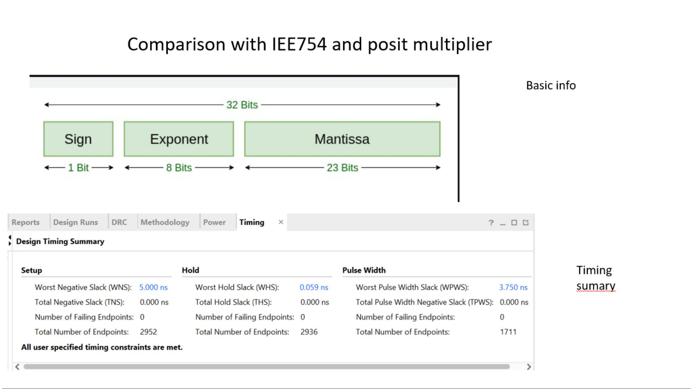

IEEE 754 uses **fixed-width fields**: 1 sign bit, 8 exponent bits, 23 mantissa bits — no dynamic allocation.

### IEEE 754 Critical Path & Power

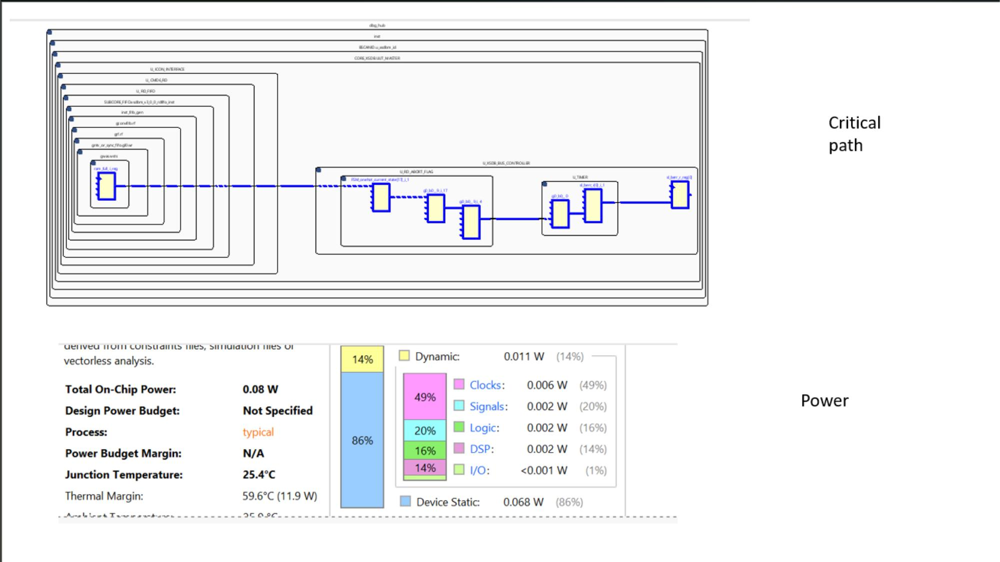

| Metric | IEEE 754 |
|---|---|
| Total On-Chip Power | 0.08 W |
| WNS | 5.000 ns |

### IEEE 754 Resource Utilisation

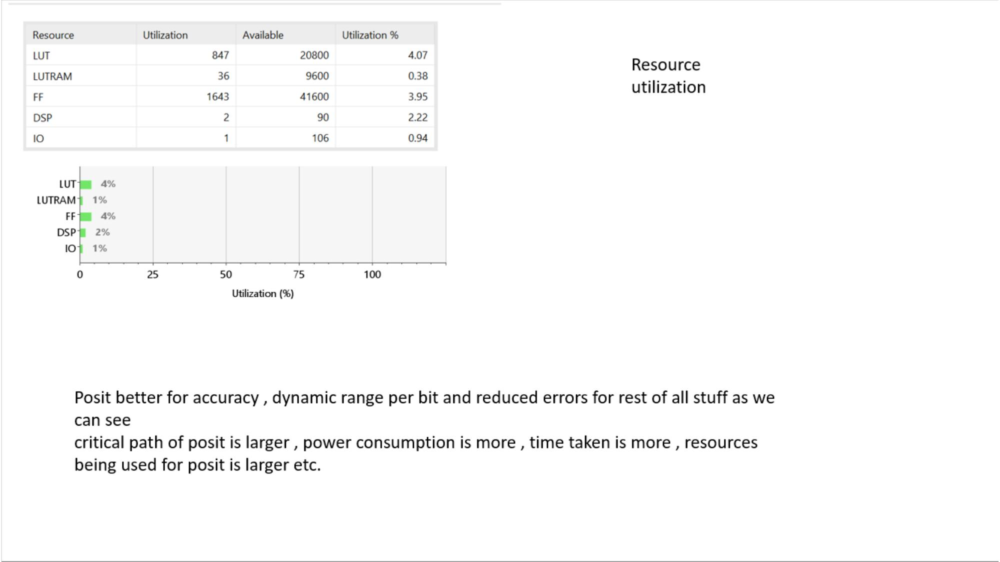

| Resource | IEEE 754 | Posit |
|---|---|---|
| LUT | 847 (4.07%) | 2158 (10.38%) |
| FF | 1643 (3.95%) | 2485 (5.97%) |
| DSP | 2 (2.22%) | 4 (4.44%) |

### 📝 Key Takeaways

| Aspect | Winner |
|---|---|
| **Accuracy / Dynamic Range per bit** | ✅ Posit |
| **Reduced rounding errors** | ✅ Posit |
| **Critical path (speed)** | ✅ IEEE 754 |
| **Power consumption** | ✅ IEEE 754 |
| **Resource efficiency** | ✅ IEEE 754 |

> Posit is better for **accuracy and dynamic range per bit**. IEEE 754 wins on **speed, power, and resource efficiency** in hardware.

---

## 📂 Repository Structure

```
posit_multiplier/
├── posit_multiplier.v        # Top-level Posit multiplier RTL (Verilog)
├── posit_multiplier_tb.v     # Testbench for functional verification
├── value.py                  # Python script for test vector generation & verification
├── constraints.txt           # FPGA timing/pin constraints
└── images/                   # All result screenshots and diagrams
```

---

## 🛠️ Tools & Technology

| Tool | Purpose |
|---|---|
| **Vivado (Xilinx)** | Synthesis, Implementation, Bitstream Generation |
| **Verilog HDL** | RTL Design |
| **DSP48 Slices** | Hardware multiplier acceleration |
| **ILA (Integrated Logic Analyzer)** | On-chip hardware debugging |
| **VIO (Virtual I/O)** | On-chip input/output for hardware testing |
| **Python** | Test vector generation & result verification |

---

## 🚀 How to Run

### Simulation
1. Open Vivado and create a new project
2. Add `posit_multiplier.v` as design source
3. Add `posit_multiplier_tb.v` as simulation source
4. Add `constraints.txt` as constraints file
5. Run **Behavioral Simulation**

### Synthesis & Implementation
1. Run **Synthesis** → **Implementation** in Vivado
2. Review timing, power, and utilization reports
3. Generate **Bitstream** and program your FPGA board

### Python Verification
```bash
python value.py
```
Enter bit-width `n` and exponent size `es` when prompted, then input binary Posit numbers A and B to verify the multiplication result and relative error.

---

## 📚 References

- Gustafson, J. L., & Yonemoto, I. T. (2017). *Beating Floating Point at its Own Game: Posit Arithmetic.* Supercomputing Frontiers and Innovations.
- IEEE 754-2008 Standard for Floating-Point Arithmetic

---

## 👥 Team

| Name | Roll Number |
|---|---|
| Akshat Mittal | IMT2023606 |
| Nachiappan | IMT2023605 |

---

## 📜 License

This project was developed for academic purposes as part of an FPGA design course. Feel free to reference or build upon it with appropriate credit.
